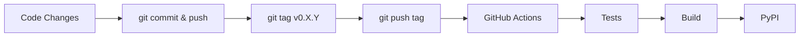

# Contributing to GAIK

Quick guide for developers.

---

## ➕ Adding New Code

### Project Module Structure

```text
packages/python/gaik/src/gaik/
├── extract/          # Text/structured data extraction (+ tests)
├── parsers/          # Vision, PDF, and other parsers (+ tests)
├── providers/        # LLM provider integrations (+ tests)
└── [your-feature]/   # New standalone modules (e.g., audio, video)
```

### Add a New Standalone Feature

For completely new capabilities (e.g., audio transcription, video processing) that don't fit into existing modules:

1. **Create your module** → `packages/python/gaik/src/gaik/[feature-name]/`

   Example: Whisper audio transcription

   ```text
   packages/python/gaik/src/gaik/audio/
   ├── __init__.py
   ├── transcriber.py
   └── utils.py
   ```

2. **Add dependencies** → [pyproject.toml](packages/python/gaik/pyproject.toml)

   Create a new optional dependency group:

   ```toml
   [project.optional-dependencies]
   audio = [
       "openai-whisper>=1.0.0",
       "torch>=2.0.0",
   ]
   all = ["gaik[extract,vision,audio]"]  # Update all group
   ```

3. **Export public API** → [src/gaik/\_\_init\_\_.py](packages/python/gaik/src/gaik/__init__.py)

   ```python
   from .audio import AudioTranscriber
   ```

4. **Add examples** → [examples/](examples/)

   Include README and usage examples

### Add a New Parser

1. Create `packages/python/gaik/src/gaik/parsers/your_parser.py`
2. Export in [src/gaik/parsers/\_\_init\_\_.py](packages/python/gaik/src/gaik/parsers/__init__.py)
3. Add dependencies to [pyproject.toml](packages/python/gaik/pyproject.toml) under `[project.optional-dependencies]`
4. Add tests in `packages/python/gaik/src/gaik/parsers/tests/test_your_parser.py`
5. Add example in [examples/parsers/](examples/parsers/)

See existing parsers for reference.

## Testing

**Tests go in:** `packages/python/gaik/src/gaik/<module>/tests/`

```bash
cd packages/python/gaik
pip install -e .[all,dev]
pytest                      # Run all tests
ruff check --fix .          # Lint
ruff format .               # Format
```

## Release Process

```bash
git commit -m "Changes"
git push origin main
git tag v0.3.0              # Must be vX.Y.Z format
git push origin v0.3.0      # Triggers GitHub Actions
```

GitHub Actions auto-publishes to PyPI.

## Project Structure

```text
gaik-toolkit/
├── packages/python/gaik/src/gaik/  # Package source
│   ├── extract/                    # Extraction + tests
│   ├── parsers/                    # Parsers + tests
│   └── providers/                  # LLM providers + tests
├── examples/                       # Usage examples
└── .github/workflows/              # CI/CD
```

## Release Flow


