# Contributing to GAIK

Quick guide for developers.

---

## ➕ Adding New Code

### Project Module Structure

```text
packages/python/gaik/src/gaik/
├── extract/          # Text/structured data extraction (+ tests)
├── parsers/          # Vision, PDF, and other parsers (+ tests)
├── providers/        # LLM provider integrations (+ tests)
└── [your-feature]/   # New standalone modules (e.g., audio, video)
```

### Extend Existing Module

Add new functionality to existing modules (e.g., `extract/`, `parsers/`, `providers/`).

#### Example: Add a new parser to `parsers/`

1. **Create parser file** → `packages/python/gaik/src/gaik/parsers/your_parser.py`

2. **Export in module** → [src/gaik/parsers/\_\_init\_\_.py](packages/python/gaik/src/gaik/parsers/__init__.py)

   ```python
   from .your_parser import YourParser
   __all__ = [..., "YourParser"]
   ```

3. **Add dependencies** → [pyproject.toml](packages/python/gaik/pyproject.toml)

   Add to existing `[parser]` group (NOT a new group):

   ```toml
   [project.optional-dependencies]
   parser = [
       "openai>=2.7",
       "PyMuPDF>=1.23.0",
       "your-new-dependency>=1.0.0",  # Add here
   ]
   ```

4. **Add tests** _(recommended)_ → `packages/python/gaik/src/gaik/parsers/tests/test_your_parser.py`

5. **Add example** _(recommended)_ → `examples/parsers/demo_your_parser.py`

### Add New Standalone Feature

Create entirely new module for capabilities that don't fit existing modules (e.g., audio, video).

#### Example: Audio transcription module

1. **Create module** → `packages/python/gaik/src/gaik/audio/`

   ```text
   packages/python/gaik/src/gaik/audio/
   ├── __init__.py
   ├── transcriber.py
   └── utils.py
   ```

2. **Add dependencies** → [pyproject.toml](packages/python/gaik/pyproject.toml)

   Create NEW optional dependency group:

   ```toml
   [project.optional-dependencies]
   audio = [
       "openai-whisper>=1.0.0",
       "torch>=2.0.0",
   ]
   all = ["gaik[extract,parser,audio]"]  # Update all group
   ```

3. **Export public API** → [src/gaik/\_\_init\_\_.py](packages/python/gaik/src/gaik/__init__.py)

   ```python
   from .audio import AudioTranscriber
   ```

4. **Add tests** _(recommended)_ → `packages/python/gaik/src/gaik/audio/tests/`

5. **Add examples** _(recommended)_ → `examples/audio/` with README

## Testing (Optional, but Recommended)

Tests are automatically run by GitHub Actions on every push. Local testing and linting are optional but help catch issues early.

**Tests go in:** `packages/python/gaik/src/gaik/<module>/tests/`

```bash
cd packages/python/gaik

# Option 1: Using activated venv (recommended for monorepo)
# Activate root venv first, then:
pip install -e .[all,dev]
pytest                      # Run all tests
ruff check --fix .          # Lint
ruff format .               # Format

# Option 2: Using uv (creates project-local .venv)
uv run pytest
uv run ruff check .
uv run ruff format .
```

## Release Process

```bash
git commit -m "Changes"
git push origin main
git tag v0.3.0              # Must be vX.Y.Z format
git push origin v0.3.0      # Triggers GitHub Actions
```

**GitHub Actions automatically:**

- Runs all tests (pytest)
- Builds the package
- Validates package (twine check)
- Publishes to PyPI
- Creates GitHub Release

**Note:** Linting (ruff) is not enforced by CI. Run locally if needed.

## Project Structure

```text
gaik-toolkit/
├── packages/python/gaik/src/gaik/  # Package source
│   ├── extract/                    # Extraction + tests
│   ├── parsers/                    # Parsers + tests
│   └── providers/                  # LLM providers + tests
├── examples/                       # Usage examples
├── scripts/                        # CI/build scripts
└── .github/workflows/              # CI/CD
```

## Release Flow

```mermaid
flowchart LR
    A[Code Changes] --> B[git commit & push]
    B --> C[git tag v0.X.Y]
    C --> D[git push tag]
    D --> E[GitHub Actions]
    E --> F[Run Tests]
    F --> G[Build Package]
    G --> H[Validate with Twine]
    H --> I[Publish to PyPI]
    I --> J[Create GitHub Release]

    style E fill:#f9f,stroke:#333
    style F fill:#bbf,stroke:#333
    style G fill:#bbf,stroke:#333
    style H fill:#bbf,stroke:#333
    style I fill:#bfb,stroke:#333
    style J fill:#bfb,stroke:#333
```


